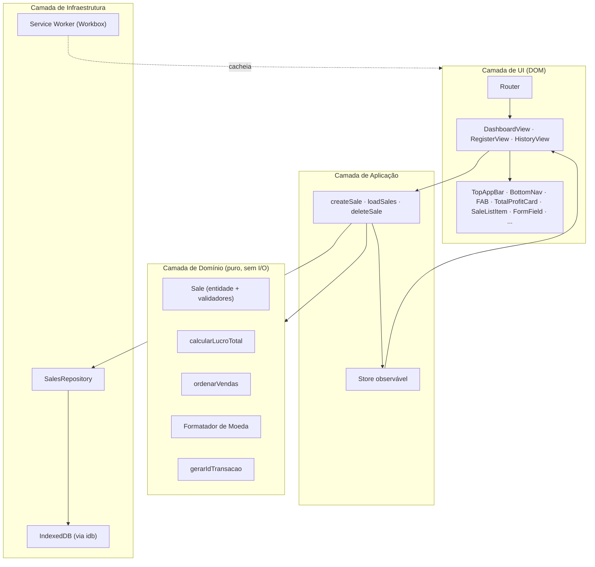
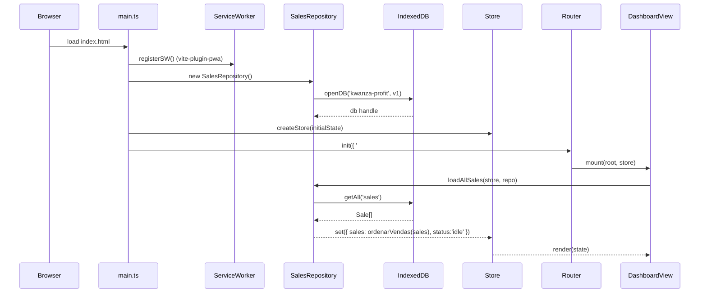
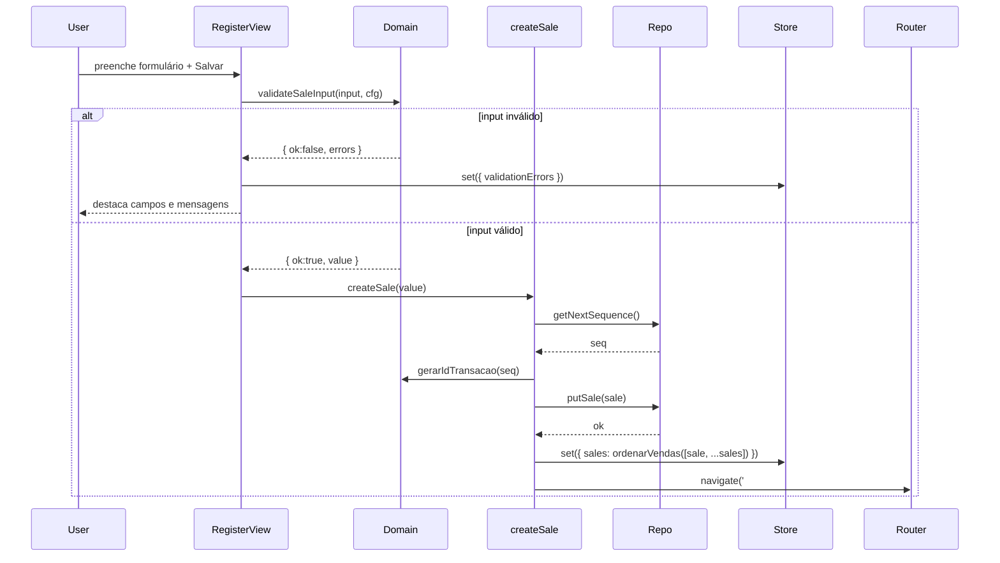
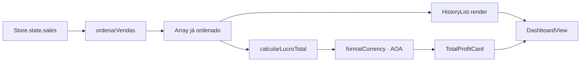

# Documento de Design — KwanzaProfit PWA

## Visão Geral

O **KwanzaProfit** é um PWA _mobile-first_ **local-first** e **sem backend** para uma casa de câmbios em Angola. O operador registra Vendas de moeda estrangeira (USD, EUR, GBP, ZAR) e acompanha o Lucro_Total em AOA no Dashboard. Toda a persistência ocorre no próprio dispositivo, o que torna a aplicação instalável, totalmente funcional offline e independente de serviços remotos.

O design foca em três pilares:

1. **Simplicidade de entrega** — artefato enxuto, com _app shell_ cacheado agressivamente, carregamento rápido em 3G e instalação como PWA.
2. **Correção do núcleo de negócio** — as regras de cálculo, ordenação, formatação monetária e persistência são funções puras e testáveis, isoladas da camada de UI, e validadas por _property-based testing_ conforme o Requisito 12.
3. **Fidelidade ao Design System** institucional (Requisito 9): _dark mode_ obsidiana + esmeralda, Inter, Material Symbols, glassmorphism, `rounded-xl` e `rounded-full`, comportamento _mobile-first_ com alternância para navegação de topo em ≥ 768 px.

Este documento descreve a arquitetura, módulos, modelo de dados, propriedades de correção derivadas dos requisitos e a estratégia de testes — deixando a implementação detalhada para a fase de Tasks.

## Decisões Arquiteturais

### 1. Framework de UI — Vanilla TypeScript + Vite

**Decisão:** usar **Vite + TypeScript + DOM vanilla** (ES Modules) com um micro _store_ observável próprio e _data-binding_ manual via renderizadores puros. **Não** adotar React/Vue/Svelte.

**Justificativa:**
- A aplicação tem 3 telas e menos de uma dúzia de componentes. Um framework de UI adicionaria 40–140 KB de _runtime_ sem ganho estrutural e aumentaria o custo do _app shell_ — crítico num PWA usado em rede móvel angolana.
- A separação limpa entre domínio (puro) e UI (DOM) é mais fácil de garantir sem um framework que misture ciclo de vida e estado.
- As HTMLs de referência já estão em Tailwind puro; a transição para módulos TS com funções `render(root, state)` é direta.
- TypeScript preserva a segurança de tipos no domínio (entidades, enums de moeda) sem exigir framework.

**Consequência:** reatividade é implementada por um `Store<T>` minimalista (`get`, `set`, `subscribe`). Componentes expõem `mount(root, store)` e re-renderizam seções inteiras de DOM em cada mudança. Para 3 telas e listas de ≲ 1000 Vendas isso é suficiente.

**Alternativas consideradas:**
- **Preact (3 KB) + `@preact/signals`** — aceitável se o código crescer; decisão reversível.
- **React + Vite** — rejeitado pelo custo de _runtime_ desproporcional ao escopo.

### 2. Persistência — IndexedDB via `idb`

**Decisão:** usar **IndexedDB** como Armazenamento_Local, encapsulado pela biblioteca `idb` (wrapper de ~1 KB baseado em Promises).

**Justificativa:**
- O Histórico_de_Vendas cresce monotonamente. `localStorage` é síncrono, limitado (~5 MB) e serializa tudo como string, o que degrada em listas grandes.
- IndexedDB é assíncrono, suporta índices (crítico para ordenação por `createdAt`) e tem cota de centenas de MB em navegadores modernos.
- `idb` fornece API promissificada sem acoplamento a framework.

**Consequência:** operações de domínio são síncronas e puras (recebem `Sale[]`), enquanto o repositório `SalesRepository` é assíncrono e isola a UI do IndexedDB. Testes de domínio não dependem do storage; testes de integração usam `fake-indexeddb`.

**Fallback:** se `indexedDB` estiver indisponível (modo privado restrito, navegador muito antigo), um adaptador `localStorageAdapter` com a mesma interface `SalesRepository` é usado. Conversão entre eles é transparente para a UI.

### 3. Roteamento — Hash Router próprio

**Decisão:** roteador SPA baseado em `location.hash` (`#/dashboard`, `#/register`, `#/history`), implementado como uma função ~30 LOC.

**Justificativa:** hash-routing funciona em qualquer host estático (inclusive `file://` durante testes manuais), não exige configuração de servidor para _fallback_ a `index.html` e preserva estado ao recarregar offline.

### 4. PWA — `vite-plugin-pwa` (Workbox)

**Decisão:** gerar o Service_Worker via `vite-plugin-pwa` em modo `generateSW` com estratégias Workbox:
- **App shell** (`index.html`, JS, CSS, fontes auto-hospedadas, ícones): `precache` + `CacheFirst`.
- **Recursos dinâmicos**: não há chamadas de rede de dados (app é 100 % local), portanto nenhuma estratégia de runtime além do shell.

**Justificativa:** evita reimplementar cache manifesto, `skipWaiting`, `clientsClaim` e _update prompts_.

### 5. Tailwind — via build, não CDN

**Decisão:** Tailwind CSS via PostCSS (build-time), com a mesma configuração de tokens dos mocks (`tailwind.config.ts`), para eliminar o `<script src="cdn.tailwindcss.com">` dos HTMLs de referência.

**Justificativa:** CDN do Tailwind não é compatível com o modelo _offline-first_ (é um _runtime_ que depende de rede e injeta CSS dinamicamente; o CSS gerado em build é menor e cacheável).

### 6. Fontes auto-hospedadas

**Decisão:** baixar Inter e Material Symbols Outlined no build (`@fontsource/inter`, arquivos estáticos de Material Symbols) em vez de carregar do Google Fonts.

**Justificativa:** o Requisito 7 exige operação offline. Fontes remotas quebram o _first render_ offline e impactam Lighthouse PWA.

## Arquitetura

### Diagrama de camadas



**Regras de dependência:**
- `domain/*` não importa nada de `infra/*` ou `ui/*`. É puro, determinístico (exceto `idGen`, que recebe um contador como parâmetro).
- `infra/*` pode importar `domain/*` para tipar dados.
- `ui/*` pode importar `domain/*` e `app/*`. Nunca importa `infra/*` diretamente — apenas via _actions_.

### Estrutura de pastas

```
kwanza-profit-pwa/
├── public/
│   ├── icons/                         # 192x192, 512x512, maskable
│   └── manifest.webmanifest
├── src/
│   ├── index.html
│   ├── main.ts                        # bootstrap
│   ├── styles/index.css               # @tailwind base/components/utilities
│   ├── app/
│   │   ├── router.ts                  # hash router
│   │   ├── store.ts                   # Store<T> observável
│   │   ├── state.ts                   # AppState: { sales, status, error }
│   │   └── actions.ts                 # createSale, loadAllSales, deleteSale
│   ├── domain/
│   │   ├── sale.ts                    # Sale, validateSaleInput, serialize/deserialize
│   │   ├── currency.ts                # CurrencyCode, CurrencyMeta
│   │   ├── profit.ts                  # calcularLucroTotal, somaIncremental
│   │   ├── ordering.ts                # ordenarVendas
│   │   ├── formatter.ts               # formatCurrency, parseCurrency
│   │   └── idGen.ts                   # gerarIdTransacao, parseSequencia
│   ├── infra/
│   │   ├── db/
│   │   │   ├── schema.ts              # versões, stores, índices
│   │   │   ├── openDb.ts              # idb.openDB + migrações
│   │   │   └── errors.ts              # QuotaExceededError, CorruptedDataError
│   │   ├── salesRepository.ts         # CRUD assíncrono
│   │   ├── localStorageAdapter.ts     # fallback
│   │   └── pwa/registerSW.ts
│   ├── ui/
│   │   ├── components/
│   │   │   ├── TopAppBar.ts
│   │   │   ├── BottomNav.ts
│   │   │   ├── Fab.ts
│   │   │   ├── TotalProfitCard.ts
│   │   │   ├── SaleListItem.ts
│   │   │   ├── EmptyState.ts
│   │   │   ├── FormField.ts
│   │   │   └── ValidationMessage.ts
│   │   └── views/
│   │       ├── DashboardView.ts
│   │       ├── RegisterView.ts
│   │       └── HistoryView.ts
│   └── sw/                            # gerado pelo vite-plugin-pwa
├── tests/
│   ├── unit/                          # vitest (domínio, formatador)
│   ├── properties/
│   │   ├── generators.ts              # arbitrários fast-check
│   │   └── *.property.test.ts
│   ├── integration/                   # fake-indexeddb
│   └── smoke/                         # manifest, SW, a11y
├── tailwind.config.ts
├── postcss.config.js
├── vite.config.ts
├── tsconfig.json
└── package.json
```

## Componentes e Interfaces

Assinaturas TypeScript resumidas (sem corpo; detalhamento fica nas Tasks).

### Domínio (puro)

```ts
// domain/currency.ts
export type CurrencyCode = 'AOA' | 'USD' | 'EUR' | 'GBP' | 'ZAR';

export interface CurrencyMeta {
  code: CurrencyCode;
  symbol: string;
  symbolPosition: 'prefix' | 'suffix';
  fractionDigits: number;   // AOA = 0, demais = 2
  thousandsSep: '.' | ',' | ' ';
  decimalSep: '.' | ',';
}

// domain/sale.ts
export interface Sale {
  id: string;               // "TRX-<seq>" com zero-padding mínimo de 4
  customerName: string;     // não-vazio após trim
  currency: Exclude<CurrencyCode, 'AOA'>;
  amount: number;           // > 0, finito
  profitAoa: number;        // finito; sinal governado por config
  createdAt: number;        // epoch ms
  deletedAt: number | null; // soft delete
}

export type SaleInput = Omit<Sale, 'id' | 'createdAt' | 'deletedAt'>;

export type ValidationError =
  | { field: 'customerName'; code: 'empty' }
  | { field: 'currency'; code: 'missing' | 'unsupported' }
  | { field: 'amount'; code: 'nonPositive' | 'notFinite' }
  | { field: 'profitAoa'; code: 'notFinite' | 'negativeNotAllowed' };

export function validateSaleInput(
  input: unknown,
  cfg: { allowNegativeProfit: boolean }
): { ok: true; value: SaleInput } | { ok: false; errors: ValidationError[] };

export function serialize(sale: Sale): Record<string, unknown>;
export function deserialize(raw: unknown): Sale;  // lança CorruptedDataError se inválido

// domain/profit.ts
export function calcularLucroTotal(sales: readonly Sale[]): number;
// Soma profitAoa de todos os Sale onde deletedAt === null.

// domain/ordering.ts
export function ordenarVendas(sales: readonly Sale[]): Sale[];
// createdAt desc; empate: id desc (Req 3.3, 3.4).

// domain/formatter.ts
export function formatCurrency(value: number, code: CurrencyCode, opts?: {
  signed?: boolean;   // quando true, positivos recebem prefixo '+'
}): string;
export function parseCurrency(text: string, code: CurrencyCode): number | null;

// domain/idGen.ts
export function gerarIdTransacao(seq: number): string; // "TRX-" + padStart(seq, 4, '0')
export function parseSequencia(id: string): number | null;
```

### Aplicação (estado e ações)

```ts
// app/state.ts
export interface AppState {
  sales: Sale[];                       // sempre ordenado por ordenarVendas
  status: 'idle' | 'loading' | 'saving' | 'error';
  validationErrors: ValidationError[];
  lastError: AppError | null;
}

// app/store.ts
export interface Store<T> {
  get(): T;
  set(updater: (prev: T) => T): void;
  subscribe(listener: (state: T) => void): () => void;
}

// app/actions.ts
export async function loadAllSales(store: Store<AppState>, repo: SalesRepository): Promise<void>;
export async function createSale(input: SaleInput, store: Store<AppState>, repo: SalesRepository): Promise<Sale | null>;
export async function deleteSale(id: string, store: Store<AppState>, repo: SalesRepository): Promise<void>;
```

### Infraestrutura

```ts
// infra/salesRepository.ts
export interface SalesRepository {
  putSale(sale: Sale): Promise<void>;            // idempotente por id
  getAll(): Promise<Sale[]>;
  getNextSequence(): Promise<number>;            // incrementa contador em 'meta'
  softDelete(id: string): Promise<void>;         // opcional (Req 10)
}
```

### UI (componentes)

| Componente | Responsabilidade | Requisitos cobertos |
|---|---|---|
| `TopAppBar` | Logo + título fixos no topo; botão voltar na RegisterView. | 9.1–9.3, 1.10 |
| `BottomNav` | Três abas (Dashboard, Register, History) com estado ativo; oculto em ≥ 768 px. | 4.3–4.7, 9.7 |
| `Fab` | Botão "+" fixo, abre `#/register`; oculto na RegisterView. | 4.1, 4.2 |
| `TotalProfitCard` | Card glassmórfico com Lucro_Total formatado e indicador de variação. | 2.1, 2.3–2.5, 9.5 |
| `SaleListItem` | Linha do Histórico: cliente, id, valor na moeda, lucro em AOA. | 3.2, 3.6, 3.7 |
| `EmptyState` | Mensagem quando o Histórico está vazio. | 3.5 |
| `FormField` | Label + input + ícone Material + área de erro. | 1.1, 9.3 |
| `ValidationMessage` | Renderiza erros de `validateSaleInput`. | 1.5–1.9 |
| `DashboardView` | Compõe `TotalProfitCard` + lista de `SaleListItem`. | 2.x, 3.x |
| `RegisterView` | Formulário; em submissão chama `createSale`; navega ao Dashboard. | 1.x |
| `HistoryView` | Lista completa; mesma ordenação do Dashboard. | 3.x |

Todo componente exporta `mount(root: HTMLElement, store: Store<AppState>): () => void` (retorna `unmount`). Renderização é total por seção — eficiente para o volume esperado.

## Modelo de Dados

### Entidade `Sale`

| Campo | Tipo | Invariantes |
|---|---|---|
| `id` | `string` | Casa regex `^TRX-\d{4,}$`; único no store. |
| `customerName` | `string` | `trim().length > 0`. |
| `currency` | `'USD' \| 'EUR' \| 'GBP' \| 'ZAR'` | Membro da lista suportada. |
| `amount` | `number` | `Number.isFinite(amount) && amount > 0`. |
| `profitAoa` | `number` | `Number.isFinite(profitAoa)`; `>= 0` quando `allowNegativeProfit=false`. |
| `createdAt` | `number` | Epoch ms, `> 0`. |
| `deletedAt` | `number \| null` | `null` por padrão; `> createdAt` quando excluída. |

### Esquema IndexedDB

- **DB:** `kwanza-profit` (versão 1 inicial; migrações futuras via `upgrade`).
- **Object store `sales`**: `keyPath: 'id'`.
  - Índice `byCreatedAt` sobre `createdAt` (suporta varredura desc para o Histórico).
  - Índice `byDeletedAt` sobre `deletedAt` (para filtrar não-excluídas).
- **Object store `meta`**: `keyPath: 'key'`.
  - Documento `{ key: 'saleSeq', value: number }` — contador monotônico para `gerarIdTransacao`.

### Representação de moeda e precisão

Valores monetários são armazenados como `number` (IEEE 754). Isso é aceitável porque:

- AOA é inteiro (zero casas decimais).
- USD/EUR/GBP/ZAR têm duas casas; o Formatador_de_Moeda arredonda em _render_ e `parseCurrency` tolera erro até `10⁻²` (ver Propriedade 12 / Req 8.6).
- Não há multiplicação ou composição financeira complexa (câmbios); o núcleo é _soma_, que é exata para inteiros AOA e com erro desprezível em duas casas se normalizadas no momento da escrita (`Math.round(value * 100) / 100`).

Caso, em revisão futura, seja exigida precisão exata para centavos, a estratégia é migrar para `bigint` em unidades menores (centavos), confinada ao domínio — sem impacto na UI.

## Fluxos Principais

### Inicialização (bootstrap + hidratação)



### Cadastro de Venda



### Renderização do Dashboard



O `Store` garante o invariante de que `state.sales` está sempre ordenado; assim as views renderizam sem reclassificar.

## Correctness Properties

*Uma propriedade é uma característica ou comportamento que deve permanecer verdadeiro em todas as execuções válidas do sistema — essencialmente, uma afirmação formal sobre o que o software deve fazer. Propriedades servem como ponte entre especificações legíveis por humanos e garantias de correção verificáveis por máquina.*

O KwanzaProfit concentra sua lógica de negócio em módulos puros (`src/domain/`), o que torna o _Property-Based Testing_ com **fast-check** especialmente adequado. A UI e o Service Worker são testados por inspeção visual e testes de exemplo. Cada propriedade abaixo será implementada como **um único teste PBT** (mínimo 100 iterações), anotada com o requisito que valida.

### Arbitrários compartilhados (`tests/properties/generators.ts`)

```ts
import fc from 'fast-check';

export const arbNomeCliente = fc.string({ minLength: 1, maxLength: 120 })
  .filter(s => s.trim().length > 0);

export const arbMoedaEstrangeira = fc.constantFrom('USD', 'EUR', 'GBP', 'ZAR' as const);
export const arbMoeda = fc.constantFrom('AOA', 'USD', 'EUR', 'GBP', 'ZAR' as const);

export const arbQuantidade = fc.double({ min: 0.01, max: 1e9, noNaN: true, noDefaultInfinity: true });

export const arbLucroAoa = fc.integer({ min: 0, max: 1e12 });

export const arbTimestamp = fc.integer({ min: 1, max: 4_102_444_800_000 }); // até ~2100
export const arbTimestampColisoes = fc.integer({ min: 0, max: 10 });        // força empates

export const arbSequencia = fc.integer({ min: 1, max: 1_000_000 });

export const arbSale = fc.record({
  id: arbSequencia.map(n => `TRX-${String(n).padStart(4, '0')}`),
  customerName: arbNomeCliente,
  currency: arbMoedaEstrangeira,
  amount: arbQuantidade,
  profitAoa: arbLucroAoa,
  createdAt: arbTimestamp,
  deletedAt: fc.option(arbTimestamp, { nil: null }),
});

export const arbListaVendas = fc.array(arbSale, { minLength: 0, maxLength: 200 });

export const arbSaleInputValido = fc.record({
  customerName: arbNomeCliente,
  currency: arbMoedaEstrangeira,
  amount: arbQuantidade,
  profitAoa: arbLucroAoa,
});

export const arbSaleInputInvalido = fc.oneof(
  // customerName vazio/whitespace
  arbSaleInputValido.chain(v => fc.constantFrom('', '   ', '\t\n', '\u00A0').map(s => ({ ...v, customerName: s }))),
  // currency fora do conjunto
  arbSaleInputValido.chain(v => fc.constantFrom('XXX', '', null as any).map(c => ({ ...v, currency: c }))),
  // amount inválido
  arbSaleInputValido.chain(v => fc.constantFrom(0, -1, Number.NaN, Number.POSITIVE_INFINITY, 'abc' as any).map(a => ({ ...v, amount: a }))),
  // profitAoa inválido
  arbSaleInputValido.chain(v => fc.constantFrom(Number.NaN, Number.POSITIVE_INFINITY, 'xx' as any).map(p => ({ ...v, profitAoa: p }))),
);
```

### Propriedade 1: Invariante de soma do Lucro_Total

*Para toda* lista finita `V` de Vendas válidas, `calcularLucroTotal(V)` deve ser igual à soma aritmética dos campos `profitAoa` dos elementos de `V` que não possuem `deletedAt` definido.

**Gerador:** `arbListaVendas` (inclui elementos com `deletedAt` não-nulo).

**Validates: Requisitos 12.1, 2.2**

### Propriedade 2: Confluência (invariância à ordem)

*Para toda* lista `V` de Vendas e toda permutação `V'` de `V`, `calcularLucroTotal(V) === calcularLucroTotal(V')`.

**Gerador:** `arbListaVendas` combinada com `fc.subarray`/embaralhamento manual para produzir a permutação.

**Validates: Requisito 12.2**

### Propriedade 3: Incremento metamórfico do Lucro_Total

*Para toda* lista `V` de Vendas e toda Venda válida não-excluída `x`, `calcularLucroTotal([...V, x]) − calcularLucroTotal(V)` deve ser igual a `x.profitAoa`. Simetricamente, para toda `V` não-vazia e todo `y ∈ V` não-excluído, `calcularLucroTotal(V) − calcularLucroTotal(V \ {y})` deve ser igual a `y.profitAoa`.

**Gerador:** `fc.tuple(arbListaVendas, arbSale.filter(s => s.deletedAt === null))`.

**Validates: Requisitos 12.3, 2.3, 10.3**

### Propriedade 4: Idempotência da ordenação

*Para toda* lista `V` de Vendas, `ordenarVendas(ordenarVendas(V))` deve ser profundamente igual a `ordenarVendas(V)`.

**Gerador:** `arbListaVendas`.

**Validates: Requisito 12.4**

### Propriedade 5: Preservação do multiset na ordenação

*Para toda* lista `V` de Vendas, o multiset de `ordenarVendas(V)` deve ser igual ao multiset de `V` (mesmos elementos por id, mesma contagem).

**Gerador:** `arbListaVendas`. Comparação via contagem agrupada por `id`.

**Validates: Requisito 12.5**

### Propriedade 6: Ordenação não-crescente com desempate por id desc

*Para toda* lista `V` de Vendas e para todo par de índices consecutivos `i, i+1` em `R = ordenarVendas(V)`, vale:

1. `R[i].createdAt > R[i+1].createdAt`; **ou**
2. `R[i].createdAt === R[i+1].createdAt` e `R[i].id > R[i+1].id` (lexicográfico, que coincide com numérico dado o zero-padding).

**Gerador:** `fc.array(arbSale.map(s => ({ ...s, createdAt: ...arbTimestampColisoes })))` — domínio reduzido de `createdAt` força empates e exercita o _tiebreak_.

**Validates: Requisitos 3.3, 3.4**

### Propriedade 7: Round-trip de serialização

*Para toda* Venda `v` válida, `deserialize(serialize(v))` deve ser profundamente igual a `v` em todos os campos (`id`, `customerName`, `currency`, `amount`, `profitAoa`, `createdAt`, `deletedAt`).

**Gerador:** `arbSale`.

**Validates: Requisitos 12.6, 5.4**

### Propriedade 8: Idempotência de `putSale` por identificador

*Para todo* repositório `r` (com `fake-indexeddb`), Venda válida `s` e inteiro `n ≥ 1`, executar `r.putSale(s)` `n` vezes deve resultar em exatamente uma entrada com `id === s.id` em `r.getAll()`, e essa entrada deve ser profundamente igual a `s`.

**Gerador:** `fc.tuple(arbSale, fc.integer({ min: 1, max: 10 }))`.

**Validates: Requisito 5.5**

### Propriedade 9: Round-trip de persistência no repositório

*Para toda* lista `V` de Vendas com ids distintos, após persistir cada elemento via `repo.putSale` (em qualquer ordem) e em seguida chamar `repo.getAll()` numa nova instância do repositório apontando para o mesmo storage, o conjunto retornado — como multiset indexado por `id` — deve ser igual a `V`.

**Gerador:** `arbListaVendas.map(V => deduplicarPorId(V))`.

**Validates: Requisitos 5.1, 5.3**

### Propriedade 10: Ids únicos, monotônicos e bem-formados

*Para todo* `n ≥ 1`, ao executar `createSale` `n` vezes consecutivas em um repositório inicialmente vazio:

1. os ids gerados são dois a dois distintos;
2. a sequência numérica extraída (`parseSequencia`) é estritamente crescente;
3. cada id casa a regex `^TRX-\d{4,}$`.

**Gerador:** `fc.integer({ min: 1, max: 50 })` para `n` + `arbSaleInputValido` repetido.

**Validates: Requisito 1.4**

### Propriedade 11: Validador rejeita toda entrada inválida

*Para toda* entrada gerada por `arbSaleInputInvalido` (união de violações: `customerName` vazio/whitespace; `currency` fora de USD/EUR/GBP/ZAR; `amount` em `{≤0, NaN, ±Infinity, string}`; `profitAoa` em `{NaN, ±Infinity, string}`; `profitAoa < 0` com `allowNegativeProfit=false`), `validateSaleInput(input, cfg)` retorna `{ ok: false, errors: [...] }` com pelo menos um erro, e `createSale(input)` não escreve no repositório. Complementarmente, `arbSaleInputValido` sempre resulta em `{ ok: true }`.

**Validates: Requisitos 1.5, 1.6, 1.7, 1.8, 1.9, 12.7**

### Propriedade 12: Forma estrutural do Formatador por moeda

*Para todo* valor numérico finito `v` e moeda `m`, `formatCurrency(v, m)` satisfaz:

- `m === 'AOA'`: termina com `" AOA"`; sem separador decimal; para `|v| ≥ 1000` contém ao menos um `.` como separador de milhar.
- `m === 'USD'`: começa com `"$"` ou `"-$"`; exatamente duas casas decimais.
- `m === 'EUR'`: começa com `"€"` ou `"-€"`; duas casas decimais.
- `m === 'GBP'`: começa com `"£"` ou `"-£"`; duas casas decimais.
- `m === 'ZAR'`: começa com `"ZAR "` ou `"-ZAR "`; duas casas decimais.

**Gerador:** `fc.tuple(fc.double({ noNaN: true, noDefaultInfinity: true, min: -1e12, max: 1e12 }), arbMoeda)`.

**Validates: Requisitos 2.5, 8.1, 8.2, 8.3, 8.4, 8.5**

### Propriedade 13: Round-trip numérico do Formatador

*Para todo* valor finito `v` com `|v| ≤ 10¹²` e moeda `m`, `|parseCurrency(formatCurrency(v, m), m) − v| ≤ 10⁻ᶠᵐ`, onde `fm = 0` para AOA e `fm = 2` para as demais.

**Gerador:** idem Propriedade 12.

**Validates: Requisito 8.6**

### Propriedade 14: Preservação de sinal no Formatador

*Para todo* `v` e `m`:

- se `v < 0`: `formatCurrency(v, m)` começa com `"-"`;
- se `v > 0` e `opts.signed === true`: começa com `"+"`;
- se `v === 0`: não começa com `"-"` nem `"+"`.

**Gerador:** `fc.tuple(fc.double({ noNaN: true, noDefaultInfinity: true, min: -1e9, max: 1e9 }), arbMoeda, fc.boolean())`.

**Validates: Requisitos 8.7, 3.7**

### Propriedade 15: SaleListItem contém todos os campos exigidos

*Para toda* Venda `s` válida, a string produzida por `renderSaleListItem(s)` contém, como substrings distintas: `s.customerName`, `s.id`, `formatCurrency(s.amount, s.currency)` e `formatCurrency(s.profitAoa, 'AOA', { signed: true })`.

**Gerador:** `arbSale` com `customerName` restrito a caracteres que não exigem escape HTML (o escape em si é coberto por teste de exemplo).

**Validates: Requisito 3.2**

### Propriedades condicionais (ativadas se os Requisitos 10 e 11 entrarem no escopo da v1)

### Propriedade 16 (condicional · Req 10): Edição preserva delta no Lucro_Total

*Para toda* lista `V`, Venda `v ∈ V` e Venda `v'` com `v'.id === v.id`, `calcularLucroTotal(substituir(V, v, v')) === calcularLucroTotal(V) − v.profitAoa + v'.profitAoa`.

**Validates: Requisito 10.2**

### Propriedade 17 (condicional · Req 11): Correção do filtro e invariante de tamanho

*Para toda* lista `V` e filtro `f`:

1. `∀ x ∈ filter(V, f) ⇒ f(x)` (apenas elementos que satisfazem);
2. `∀ x ∈ V, f(x) ⇒ x ∈ filter(V, f)` (não perde nenhum);
3. `length(filter(V, f)) ≤ length(V)`;
4. `calcularLucroTotal(filter(V, f)) === Σ { x.profitAoa | x ∈ V ∧ f(x) ∧ x.deletedAt == null }`.

**Validates: Requisitos 11.1, 11.2, 11.4, 11.5**

## Tratamento de Erros

A aplicação modela erros como objetos de domínio tipados — não como exceções genéricas — para que a UI possa reagir de forma específica.

```ts
export type AppError =
  | { kind: 'Validation'; errors: ValidationError[] }
  | { kind: 'QuotaExceeded' }
  | { kind: 'CorruptedData'; id?: string; reason: string }
  | { kind: 'StorageUnavailable'; reason: string }
  | { kind: 'Unknown'; cause: unknown };
```

| Condição | Detecção | Resposta |
|---|---|---|
| Formulário inválido (Req 1.5–1.9) | `validateSaleInput` retorna `{ ok:false }`. | `ValidationMessage` inline por campo; botão Salvar permanece habilitado; nada persistido. |
| **Quota excedida** (Req 5.6) | `DOMException.name === 'QuotaExceededError'` em `putSale`. | Transação do IndexedDB aborta (nada escrito); `Store.lastError = { kind:'QuotaExceeded' }`; snackbar não-bloqueante; dados anteriores intactos. |
| **Dados corrompidos** no storage | `deserialize` lança `CorruptedDataError` para registros com campos inválidos/ausentes. | O registro com defeito é excluído da lista em memória (não é apagado do DB), e seu id é logado. Outros registros são entregues normalmente. Permite recuperação manual. |
| **IndexedDB indisponível** | `openDB` rejeita ou `indexedDB === undefined` (modo privado restrito, navegador antigo). | Fallback automático para `localStorageAdapter`. Se também indisponível, UI exibe página de erro com orientação. |
| **Service Worker falha ao registrar** | `registerSW` rejeita. | App continua funcional em modo degradado (sem offline). Log do erro; nenhuma barreira ao usuário. |
| **Parse do formatador** | `parseCurrency` retorna `null` quando a string não casa o formato esperado. | Chamadores tratam `null` como erro de validação. |

**Princípios adotados:**

- Nenhum `try/catch` silencia erros sem reportar ao `Store.lastError`.
- Operações de escrita são atômicas por transação do IndexedDB — nunca deixam o store num estado intermediário.
- Dados em memória são a fonte-da-verdade durante a sessão; o storage é a fonte-da-verdade entre sessões.

## Estratégia de Testes

Quatro camadas, da mais rápida para a mais lenta:

### 1. Testes unitários (Vitest)

Foco: funções puras de `domain/` e formatadores.

- `formatter.test.ts` — exemplos por moeda (tabela) + PBT Propriedades 12, 13, 14.
- `ordering.test.ts` — exemplos de tiebreak + PBT Propriedades 4, 5, 6.
- `profit.test.ts` — PBT Propriedades 1, 2, 3.
- `sale.test.ts` — validações exemplo-a-exemplo + PBT Propriedade 11.
- `idGen.test.ts` — PBT Propriedade 10.

### 2. Testes baseados em propriedades (Vitest + fast-check)

Infraestrutura compartilhada em `tests/properties/generators.ts` define os arbitrários reutilizáveis listados acima.

**Convenções obrigatórias:**

- Mínimo **100 iterações** por `fc.assert` (`numRuns: 100`).
- Cada teste recebe um comentário de tag:

  ```ts
  // Feature: kwanza-profit-pwa, Property 1: Invariante de soma do Lucro_Total
  it('Propriedade 1 — calcularLucroTotal é a soma dos lucros não-excluídos', () => { ... });
  ```

- Seeds determinísticos registrados (`fc.configureGlobal({ seed: process.env.FC_SEED })`) para reprodutibilidade em CI.
- Falhas reportam o contra-exemplo encolhido pelo `fast-check`.

### 3. Testes de integração (Vitest + `fake-indexeddb`)

Foco: `SalesRepository` contra um IndexedDB real-em-memória.

- `salesRepository.integration.test.ts` — PBT Propriedades 8 e 9 + exemplos de migração de schema.
- `bootstrap.integration.test.ts` — fluxo de inicialização: popular DB → reabrir → confirmar `loadAllSales` devolve o mesmo conjunto (Req 5.3).
- `quota.integration.test.ts` — mock de `QuotaExceededError`; asserção de que `Store.lastError` é populado e a lista prévia permanece (Req 5.6).

### 4. Testes _smoke_ e _e2e_ (Playwright, em CI)

- **Manifest e Service Worker**: parse de `manifest.webmanifest`, asserções sobre `theme_color`/`background_color`, ícones 192/512 (Req 6.1, 6.2, 6.4).
- **Offline**: `context.setOffline(true)` após primeira visita → navegar entre telas e registrar uma Venda (Req 7.2–7.4).
- **Acessibilidade**: `@axe-core/playwright` nas três telas principais.
- **Lighthouse CI**: orçamento PWA ≥ 90.
- **Ausência de rede**: mock de `fetch` durante fluxos de domínio garante que não há chamadas a hosts remotos (Req 5.2).

### Cobertura alvo

Domínio (`src/domain`, `src/app`): linhas ≥ 95 %, branches ≥ 90 %, mutation score (Stryker, opcional) ≥ 80 %. UI: linhas ≥ 70 % (componentes são reconstruídos por pequenas funções puras de render e dependem mais de testes de contrato visual).

## Acessibilidade e Responsividade

### Acessibilidade (WCAG 2.1 AA como meta)

- **Contraste**: as cores do Design System atendem AA em combinação `on-surface/surface` (21:1) e `primary/on-primary` (≈ 8:1). O card glassmórfico deve validar contraste do texto sobre o gradiente (teste específico em Playwright + axe).
- **Foco visível**: todos os interativos (inputs, botões, itens da BottomNav, FAB) expõem `focus-visible` em esmeralda.
- **Teclado**: ordem tab coerente com o fluxo visual (TopAppBar → campos do formulário → Salvar → FAB → BottomNav). Enter em qualquer campo do formulário submete.
- **ARIA**:
  - `main[role="main"]`, `nav[aria-label="Navegação principal"]` na BottomNav.
  - `TotalProfitCard` com `role="status"` e `aria-live="polite"` para anunciar atualizações.
  - `Fab` com `aria-label="Registrar nova venda"`.
  - Mensagens de validação com `role="alert"`.
- **Movimento**: respeitar `prefers-reduced-motion` para transições do FAB e da navegação.
- **Zoom**: layout suporta redimensionamento de texto até 200 %.

Validação total de conformidade WCAG exige testes manuais com tecnologias assistivas e revisão por especialista em acessibilidade; os testes automatizados (axe) cobrem apenas um subconjunto.

### Responsividade (Req 9.6, 9.7)

Breakpoints Tailwind adotados:

| Faixa | Layout |
|---|---|
| `< 768 px` (padrão) | Coluna única, margem 16 px, BottomNav visível, FAB flutuante. |
| `≥ 768 px` (`md:`) | Container com largura máxima `max-w-4xl`, margem 32 px, navegação no topo, BottomNav oculta (`md:hidden`). |
| `≥ 1024 px` (`lg:`) | Cards lado a lado no Dashboard (opcional, não-funcional). |

- Larguras de referência validadas em testes visuais: 320, 375, 414 (mobile), 768 (tablet), 1280 (desktop).
- Touch-targets mínimos de 48×48 px (BottomNav items, FAB, botões do formulário).
- Safe-area inset respeitada em iOS via `env(safe-area-inset-bottom)` na BottomNav (classe utilitária `pb-safe`).

## Matriz de Rastreabilidade Requisito → Componente/Módulo

| Requisito | Módulo/Componente principal | Propriedades relacionadas |
|---|---|---|
| 1.1 Campos do formulário | `ui/views/RegisterView`, `ui/components/FormField` | — |
| 1.2 Moedas suportadas | `domain/currency` (`CurrencyCode`) | P12 |
| 1.3 Persistência e navegação no submit | `app/actions.createSale`, `infra/salesRepository` | P7, P8, P9 |
| 1.4 Id `TRX-<seq>` + timestamp | `domain/idGen`, `salesRepository.getNextSequence` | P10 |
| 1.5–1.9 Validações | `domain/sale.validateSaleInput` | P11 |
| 1.10 Botão voltar | `ui/components/TopAppBar`, `app/router` | — |
| 2.1, 2.5 Card de Lucro_Total | `ui/components/TotalProfitCard`, `domain/formatter` | P12 |
| 2.2 Cálculo do Lucro_Total | `domain/profit.calcularLucroTotal` | P1, P2 |
| 2.3 Atualização reativa | `app/store`, `app/actions.createSale` | P3 |
| 2.4 Estado vazio do total | `TotalProfitCard` + `formatCurrency(0,'AOA')` | — |
| 2.6 Variação percentual | `TotalProfitCard` (bloco condicional) | — |
| 3.1, 3.5 Seção + empty state | `ui/views/DashboardView`, `ui/components/EmptyState` | — |
| 3.2 Campos renderizados na linha | `ui/components/SaleListItem` | P15 |
| 3.3, 3.4 Ordenação | `domain/ordering.ordenarVendas` | P4, P5, P6 |
| 3.6, 3.7 Formatação na linha | `domain/formatter` | P12, P14 |
| 4.1, 4.2 FAB | `ui/components/Fab`, `app/router` | — |
| 4.3–4.7 BottomNav | `ui/components/BottomNav`, `app/router` | — |
| 5.1, 5.3 Persistência local e hidratação | `infra/salesRepository`, `infra/db/openDb` | P7, P9 |
| 5.2 Sem backend | Todo o módulo `infra` (ausência de `fetch`) | smoke |
| 5.4 Round-trip | `infra/salesRepository` + `domain/sale.serialize` | P7 |
| 5.5 Idempotência por id | `infra/salesRepository.putSale` | P8 |
| 5.6 Quota excedida | `infra/db/errors`, `app/store.lastError` | teste de integração |
| 6.1, 6.4 Manifesto PWA | `public/manifest.webmanifest` | smoke |
| 6.2, 6.3 Registro do SW | `infra/pwa/registerSW` + `vite-plugin-pwa` | smoke/e2e |
| 7.1–7.5 Offline | `vite-plugin-pwa` (Workbox), `infra/salesRepository` | e2e |
| 8.1–8.5 Regras por moeda | `domain/formatter.formatCurrency` | P12 |
| 8.6 Round-trip numérico | `domain/formatter.parseCurrency` | P13 |
| 8.7 Sinal preservado | `domain/formatter.formatCurrency` | P14 |
| 9.1–9.7 Design System | `tailwind.config.ts`, componentes UI, CSS global | visual/e2e |
| 10.1–10.4 Editar/excluir (opcional) | `HistoryView`, `app/actions.deleteSale`, repo | P3 (delete), P16 |
| 11.1–11.5 Filtros (opcional) | `DashboardView`, `domain/filter` (novo) | P17 |
| 12.1–12.7 Propriedades centrais | `domain/profit`, `domain/ordering`, `domain/sale` | P1, P2, P3, P4, P5, P7, P11 |

## Itens em aberto relevantes para o design

Herdados do `requirements.md` e que podem impactar as Tasks:

1. **Lucro negativo** — o design pressupõe `allowNegativeProfit = false` (Req 1.9). Se ligado, a Propriedade 11 tem comportamento condicional e o gerador `arbSaleInputInvalido` deve refletir.
2. **Variação percentual** (Req 2.6) — janela de comparação indefinida. `TotalProfitCard` expõe _slot_ opcional; o cálculo vai para `domain/profit` assim que a janela for decidida.
3. **Edição/Exclusão (Req 10)** e **Filtros (Req 11)** — opcionais na v1. `HistoryView` e `DashboardView` estão desenhados para aceitar essas extensões sem reorganização estrutural.
4. **Casas decimais do AOA** — assumido zero por padrão. Migração para centavos exigiria apenas ajustar `CurrencyMeta.fractionDigits` e regenerar os testes afetados.
